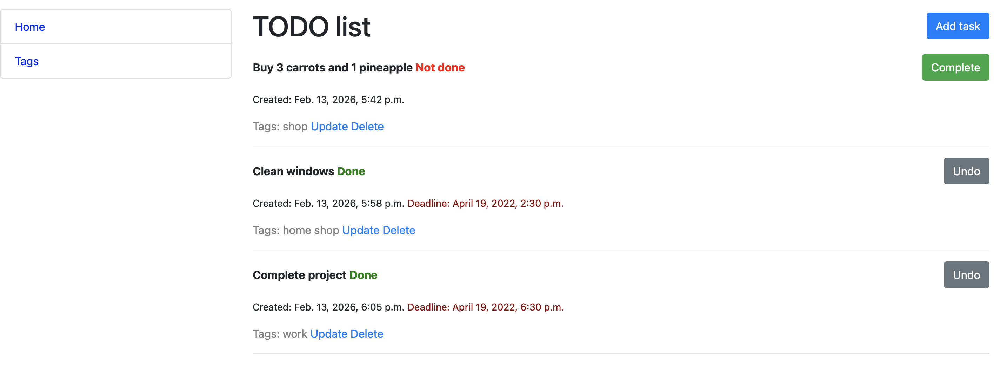
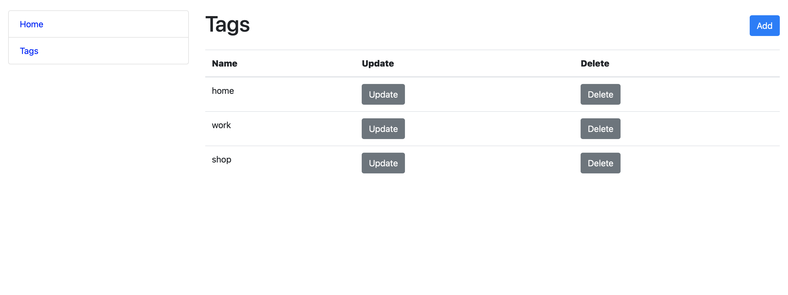

# TODO LIST

The project lets you create tasks, set optional deadlines, group tasks with tags, and track completion status.

## Pages

**Home** - todo list of tasks (completed and active).  

**Tags** - choose theme of the task.

## Overview





## Run locally

```bash
python manage.py runserver
```
